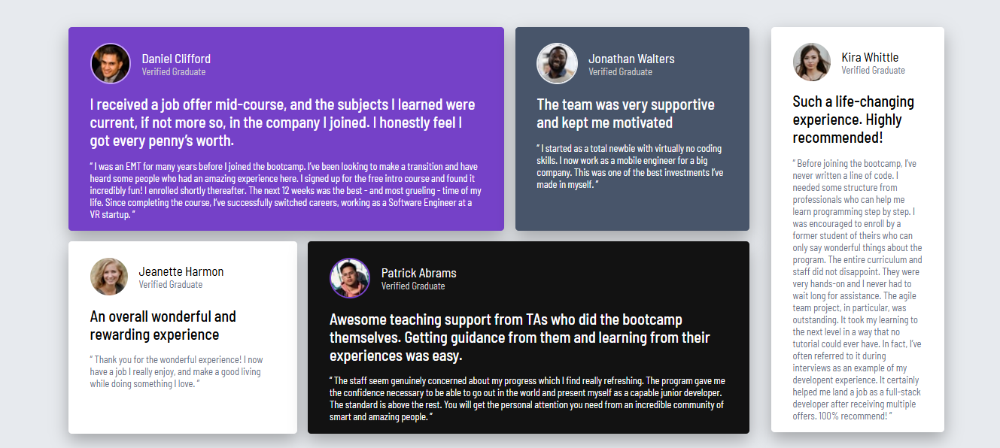

# Frontend Mentor - Testimonials grid section solution

This is a solution to the [Testimonials grid section challenge on Frontend Mentor](https://www.frontendmentor.io/challenges/testimonials-grid-section-Nnw6J7Un7). 

## Table of contents

- [Overview](#overview)
  - [Screenshot](#screenshot)
  - [Links](#links)
- [My process](#my-process)
  - [Built with](#built-with)
  - [What I learned](#what-i-learned)

## Overview

### The challenge

This challenge focused on recreating a multi-card testimonial layout using modern CSS techniques. It required building a responsive design that adapts across screen sizes while accurately matching the structure and alignment of the original reference. The main challenge was arranging different card sizes and positions using CSS Grid, ensuring consistent spacing, and keeping the layout clean and visually balanced.

### Screenshot

### Links

- Solution URL: [Add solution URL here](https://github.com/ayeshalatif1/testimonialGridSection)
- Live Site URL: [Add live site URL here](https://ayeshalatif1.github.io/testimnialGridSection/)

## My process

### Built with

- Semantic HTML5 markup
- CSS custom properties
- CSS Grid
- Mobile-first workflow
- [React](https://reactjs.org/) - JS library

### What I learned

During this project, I learned how to build responsive layouts using CSS Grid, including placing elements precisely with properties like grid column/row start/end. Additionally, I improved my use of CSS variables, typography, and color styling to match a given UI design more closely.

